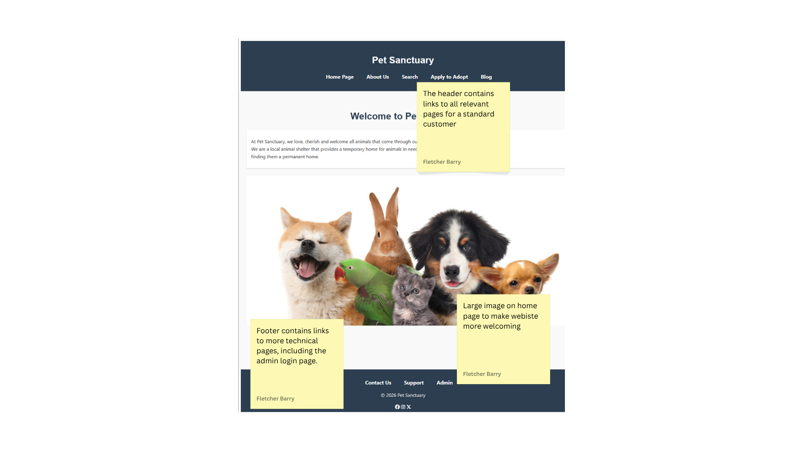
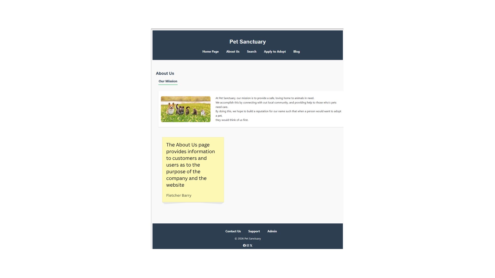
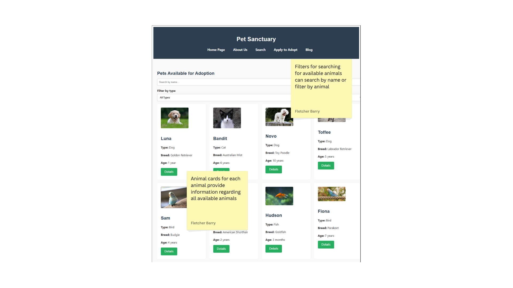
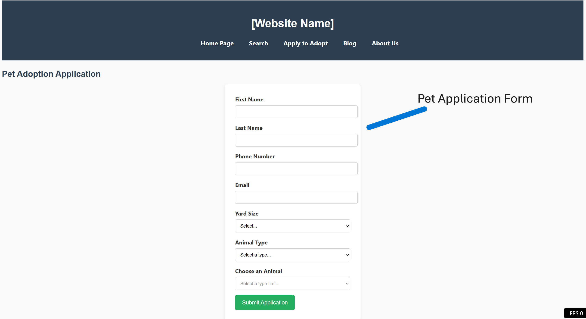
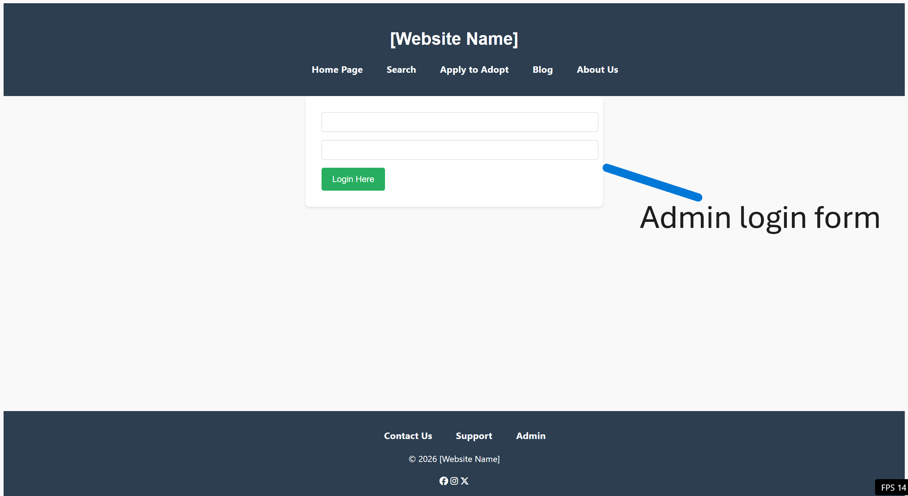
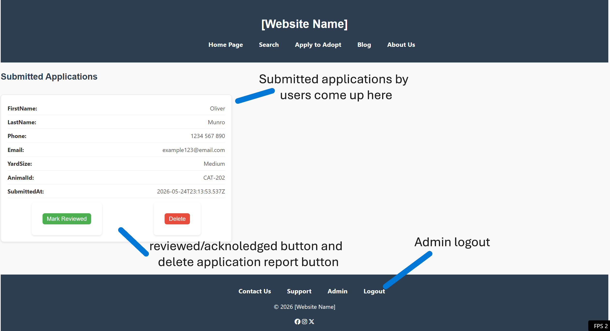

# Assessment 2: Website Solution

- **Author**: Fletcher Barry
- **FAN:** barr0606
- **Student ID:** 2368193

---
# Implementation Report
## Website Functionality
### Website Pages

Home Page - Fletcher Barry

About Us Page - Fletcher Barry

Search Page - Fletcher Barry

 Applications Page - Oliver Munro

 Admin Page - Oliver Munro

 AdminMain Page - Oliver Munro

### Back-End Fucntionality
**Fletcher Barry:**  
I worked on the back-end functionality for the search page, for this, i created a JSON file that contained all of the pet infortion, including; Pet ID, Name, Animal, Breed, an image file and Age. I then used Java Script to display this imforation as cards, and so that they could be filtered.  

**Oliver Munro:**  
I did the backend functionality for the Applications page, the Admin page, and the AdminMain page. This involved creating two json files, one to store application reports, and one to store the admin accounts and passwords. I ended up needing to make 5 different backend php pages to cover all my bases, as well as two seperate JS files.  

I had to have a backend php file (saveApplication.php) to communicate between my json data file, and my two different admin pages. I ended up needing the same for the Admin login page, as i needed a file to communicate between my JS file and my json and php front end file.

### Style Guide Summary
**Fletcher Barry:**  
The style focused on simple and familiar, as well as being easy to read and understand, we made sure that images were easy to see as well as text being able to be read easily. Some elements of the page, like links to other pages, were made to be responsive for whenever the customer would hover over the links, this allowed for the user to recognise that the text was actually a link to another page.  

**Oliver Munro:**  
I just created a few CSS definitions for the admin pages. i didnt need to do much CSS as Fletcher smashed it out early for the header and footer php files so that we could have that same style across the whole site to keep it looking simple and familiar.  

---

## Individual Reflections
### Fletcher Barry
I worked on three pages for this assessment: the home page, the about us page, and the search page. I spent the most time working on the related tasks available on Canvas since I didn’t know how to code with any of the languages used in this assessment. The prototype does not accurately follow what was designed in the wireframes. This was due to a couple of different reasons, with the biggest reason being that some design choices made in the wireframes did not match what I was able to make, as it was outside of my skill set. The website itself was not too complex to make, as most of the complexity was learned through trial and error with the Canvas tasks, so when designing my pages, I had a decent amount of knowledge regarding how I wanted certain aspects of the website to look and function. Some complications occurred when I was finally able to start thinking about creating the webpages, starting with GitHub being unable to open a port for our repositories. This occurred due to there being a “- “present at the end of the repository name, which messed with how GitHub reads and runs files. To fix this issue, I copied all the files within the original repository and created a new repository with the dash at the end. The next issue was that when we clicked on the " View on Browser " option for the port, it would not take us to the site pages. To solve this, we figured out that we needed to copy the relative path for a specific webpage, then paste it at the end of the URL, and then delete “srl” from the URL. After these issues were sorted out, the webpages could then be created.  

### Oliver Munro
Building this website allowed me to consolidate skills I already had while pushing me into areas where I was less confident, particularly with PHP and server‑side behaviour. I came into the project with experience working with JSON data files and JavaScript‑based backend logic, so handling structured data and thinking about application flow felt familiar. However, implementing similar logic in PHP required me to rethink how the server processes requests, manages sessions, and handles redirects.

One of the biggest lessons I learned was how strict PHP is about output order and file structure. Small details like a comment or whitespace before a session_start() call can break an entire login system. Debugging issues such as “headers already sent” or 404 errors taught me to be more methodical about checking file paths, understanding relative vs absolute links, and ensuring that PHP scripts don’t accidentally send output too early. These problems were frustrating at first, but solving them helped me understand how the server interprets files and why PHP behaves differently from JavaScript.

Working with JSON in PHP was also a useful extension of what I already knew. I had to handle cases where the JSON file was empty, invalid, or missing, and write defensive code to prevent warnings or crashes. This reinforced the importance of validating data and preparing for edge cases, especially when building admin‑facing tools.

On the design side, creating wireframes and structuring the admin interface helped me think more intentionally about user experience. I had to consider how an admin would navigate the system, how information should be grouped, and how to keep the interface simple and readable.  

### Joshua Hearne

---
## Appendix
### Repository Activity Log